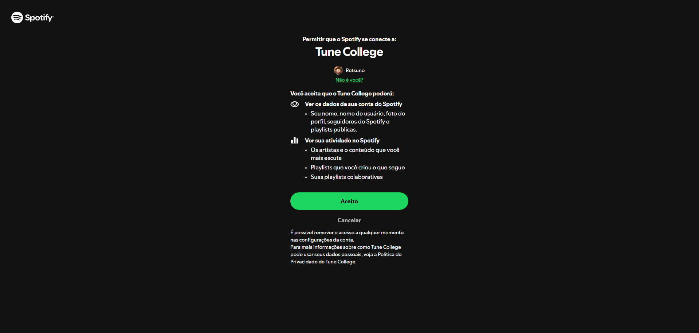
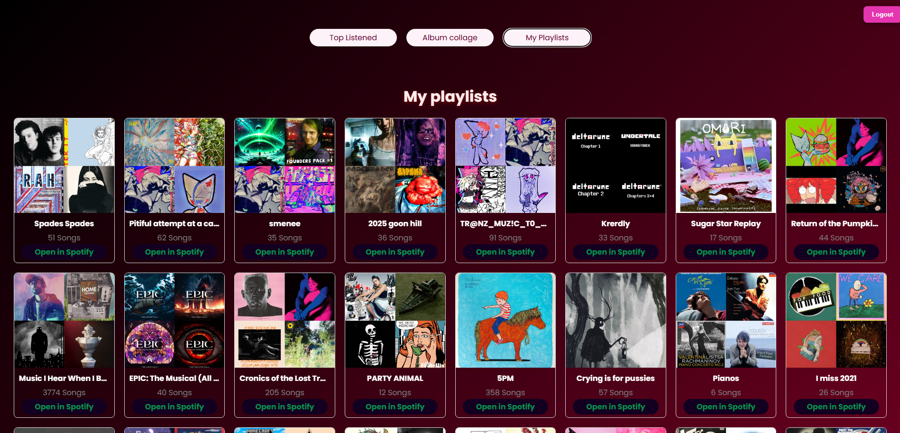
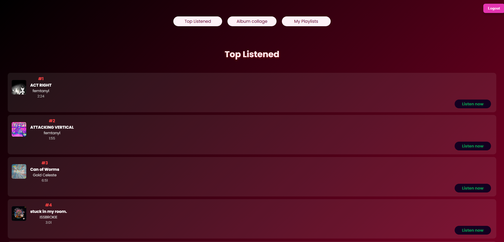
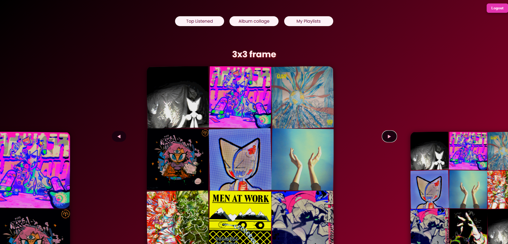

# Spotify Wrapped — Projeto Integrador
👥 Integrantes do Grupo

Vitor de Assis P. Borges, Rafael Furtado, Ryan Ribeiro

Aplicação web inspirada no **Spotify Wrapped**, desenvolvida como parte do **Projeto Integrador** do curso de Ciência da Computação.

O projeto consome a **Spotify Web API** para coletar e apresentar dados musicais do usuário, como hábitos de escuta e preferências, organizando essas informações de forma visual e interativa.

---

## 📌 Objetivo do Projeto

Desenvolver uma aplicação prática que integre:
- Consumo de APIs externas
- Autenticação com serviços terceiros
- Manipulação e visualização de dados
- Desenvolvimento de aplicações frontend modernas

---

## 🛠️ Tecnologias Utilizadas

- React
- JavaScript (ES6+)
- HTML5 / CSS3
- Spotify Web API
- Node.js / npm

---

##  Como executar o projeto localmente

> ⚠️ **Importante:** antes de rodar qualquer comando, instale as dependências do projeto.

### 
1️⃣ Instalar dependências
npm install

2️⃣ Executar o projeto
npm start

## 🖼️ Visão geral do projeto

### Tela inicial

  

### Conexão com o Spotify

  

### Tela de carregamento

  

### Playlists

  

  ###  Músicas mais ouvidas

  

### Album Collage

  

